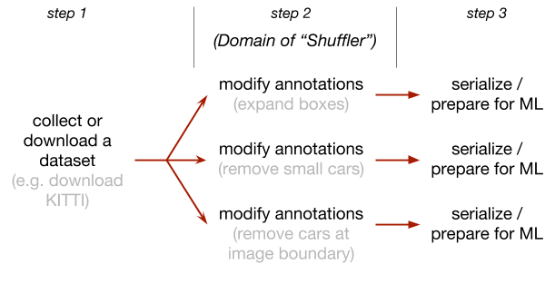

# Shuffler

Toolbox for playing with data when preparing to train a model in computer vision.

- [Motivation](#motivation)
- [Functionality](#functionality)
- [Installation](#installation)
- [Gentle introduction](#gentle-introduction)
- [Example use cases](#example-use-cases)
- [Running unittests](#running-unittests)




## Motivation

Preparing training data for ML is easy, you may think. You just take your dataset and export it into a format used by Tensorflow/PyTorch.

But what if you have many experiments, your data is updated every so often, and new ML architectures are built daily? What if new labels need to be created out of old labels? What if, in addition, the data is a mix of several public and private datasets? This is how chaos develops, gradually consuming all the developer time in maintaining data processing scripts.

Shuffler solves these problems, organizing data processing into convenient data flow pipelines.

For example, in order to [merge public self-driving datasets](https://medium.com/safety-pool/the-very-first-standard-we-need-for-autonomous-vehicles-449821f08a20), we need to filter out some labels and to bring the rest of them to a common set of classes.

## Functionality

Shuffler is a command line tool. It receives a dataset on input, performs a number of operations, and then records the output, like this:

```bash
./shuffler.py -i allObjects.db -o onlyWide.db \
  filterObjectsSQL "SELECT objectid WHERE width > 20"
```

Operations fall under these categories:

- [Import](https://github.com/kukuruza/shuffler/blob/master/doc/Subcommands.md#import) most common computer vision datasets. The list of supported datasets is growing.
- [Aggregate information](#info) about a dataset. Print basic statistics, plot histograms, and scatter plots.
- [GUI](https://github.com/kukuruza/shuffler/blob/master/doc/Subcommands.md#gui) lets a user to manually loop through a dataset, visualize, modify, and delete entries.
- [Filter](https://github.com/kukuruza/shuffler/blob/master/doc/Subcommands.md#filter) annotations, e.g. small objects, objects at image boundary, or objects without a color.
- [Modify](https://github.com/kukuruza/shuffler/blob/master/doc/Subcommands.md#modify) a dataset, e.g. increase bounding boxes by 20%, split a dataset into "train" and "test" subsets
- [Evaluate](https://github.com/kukuruza/shuffler/blob/master/doc/Subcommands.md#evaluate). Given ground truth and predictions, evaluate performance of object detection or semantic segmentation.
- Export. We provide a [PyTorch Dataset class](https://pytorch.org/tutorials/beginner/data_loading_tutorial.html#dataset-class) to directly load data from PyTorch. I plan to implement [Keras Dataset class](https://keras.io/utils/#sequence) and export to popular formats such as PASCAL.


## Installation with Conda

### Shuffler package

Shuffler requires Python3. The installation instructions assume Conda package management system.

Install dependencies:

```bash
conda create -n shuffler python=3.7
conda activate shuffler

conda install -y -c conda-forge ffmpeg=4.0
conda install -y imageio matplotlib lxml simplejson progressbar2 pillow scipy opencv=3

# If desired, add support for plotting commands
conda install -y pandas seaborn
```

Clone this project:

```bash
git clone https://github.com/kukuruza/shuffler
```

To test the installation, run the following commands. The installation succeeded if an image opens up. Press Esc to close the window.

```bash
cd shuffler
./shuffler.py -i 'testdata/cars/micro1_v4.db' --rootdir 'test' examineImages
```

### Only the interface to Keras, Pytorch, and DatasetWriter

The `shuffler.py` tool requires Python3, but the Keras generators, Pytorch datasets, and Shuffler Dataset Writer can be run in Python2 or Python3.

The commands below will install the dependencies necessary for using them. Conda environment may be using Python2 or Python3

```bash
conda install -y -c conda-forge ffmpeg=4.0
conda install -y imageio progressbar2 pillow numpy opencv=3
```


## Gentle introduction

### Shuffler's format for annotations

Shuffler introduces a new format to store annotations. Annotations and path to images are stored in a relational database. Two database files `dataset1.db` and `dataset2.db` may have different annotations for the same image set.

In practice, you play with a dataset, and save the result as `dataset1.db`. Then you play a bit more and save the result as `dataset2.db`. Without Shuffler, you would probably have to copy and change the whole folder with annotations, and perhaps also with images.

You can import most well-known formats and save them in Shuffler's format. For example, importing Pascal VOC looks like this (we assume you have downloaded Pascal VOC to `${VOC_DIR}`):

```bash
./shuffler.py -o myPascal.db \
  importPascalVoc2012 ${VOC_DIR} --annotations
```

You can open `myPascal.db` with any SQLite3 editor/viewer and manually inspect data entries, or run some SQL on it.

Once you dataset is ready for machine learning, you can export data to one of the well-known formats, or even better, feed it directly to Keras or PyTorch using provided data loader classes.

```bash
./shuffler.py -i myPascal.db \
  exportCoco --coco_dir ${COCO_DIR} --subset myTrainSubset
```

The toolbox supports datasets consisting of 1) images and masks, 2) objects annotated with masks, polygons, and bounding boxes, and 3) matches between objects. It stores annotations as a SQL database of its custom format. This database can be viewed and edited manually with any SQL viewer.


### Chaining sub-commands

Sub-commands can be chained via the special symbol `'|'`. Here, the vertical bar is quoted with single quotes, which works in Windows, Linux and Mac. (Alternatively, in Unix, you can  use `\|`, that is, a vertical bar escaped by a backslash.)

```bash
./shuffler.py --rootdir 'test' -i 'testdata/cars/micro1_v4.db' \
  addVideo --image_video_path 'testdata/moon/images.avi' --mask_video_path 'testdata/moon/masks.avi' '|' \
  printInfo '|' \
  moveMedia --image_path 'testdata/cars/images' --where_image 'imagefile LIKE "cars/images/%"' '|' \
  dumpDb --tables 'images' 'objects'

./shuffler.py --rootdir 'test' -i 'testdata/cars/micro1_v4.db' \
  addDb --db_file 'testdata/cars/micro1_v4_singleim.db' '|' \
  mergeObjectDuplicates '|' \
  polygonsToMask --media='pictures' --mask_path 'cars/mask_polygons' --skip_empty_masks '|' \
  dumpDb --tables images '|' \
  examineImages --mask_alpha 0.5
```

### Using standard SQLite commands with Shuffler annotations format.

The beauty of storing annotations in a relational SQLite3 database is that one can use standard SQL editors to explore them. For example, UNIX has a command line tool `sqlite3`.

The commands below illustrate using `sqlite3` to get some statistics about the database `testdata/cars/micro1_v4.db` bundled into this repository.

```bash
# Find the total number of images:
sqlite3 testdata/cars/micro1_v4.db 'SELECT COUNT(imagefile) FROM images'

# Find the total number of images with objects:
sqlite3 testdata/cars/micro1_v4.db 'SELECT COUNT(DISTINCT(imagefile)) FROM objects'

# Print out names of objects and their count:
sqlite3 testdata/cars/micro1_v4.db 'SELECT name, COUNT(1) FROM objects GROUP BY name'

# Print out dimensions of all objects of the class "car":
sqlite3 testdata/cars/micro1_v4.db 'SELECT width, height FROM objects WHERE name="car"'
```


## Example use cases

#### An image dataset has objects named "car". Need to manually assign label "type" to them ([link to the tutorial](https://github.com/kukuruza/shuffler/blob/master/doc/Usercase-labelling/Usercase-labelling.md)).

An image dataset contains objects of class "car", among other classes. We would like to additionally classify cars by type for more fine-grained detection. An image annotator needs to go through all the "car" objects, and assign one of the following types to them: "passenger", "truck", "van", "bus", "taxi".

#### Import annotations from [LabelMe](http://labelme.csail.mit.edu/Release3.0). Each image is labelled by multiple annotators ([link to the tutorial](https://github.com/kukuruza/shuffler/blob/master/doc/Usercase-merge-annotations/Usercase-merge-annotations.md)).

A user has collected a dataset of images with objects. Images were handed out to annotators who use LabelMeAnootationTool. Each image was annotated with polygons by multiple annotators for the purposes of cross-validation. A user would like to to 1) import labels from all annotators, 2) merge polygons corresponding to the same object, 3) make black-gray-white image masks, where the gray area marks the inconsistency among annotators.

#### Combine [KITTI](http://www.cvlibs.net/datasets/kitti), [BDD](https://bair.berkeley.edu/blog/2018/05/30/bdd), and [PASCAL VOC 2012](http://host.robots.ox.ac.uk/pascal/VOC) datasets into one ([link to the tutorial](https://github.com/kukuruza/shuffler/blob/master/doc/Usercase-combining-datasets/Usercase-combining-datasets.md)).

A user works on object detection tasks for the autonomous car scenario, and would like to use as many annotated images as possible. In particular, they aim to combine certain classes from the datasets KITTI, BDD, and PASCAL VOC 2012. Then the combined dataset is exported in COCO format.

#### Train object detection with only big objects. Then evaluate.

We have a dataset with objects given as bounding boxes. We would like to remove objects on image boundary, expand bounding boxes by 10% for better training, remove objects of all types except "car", "bus", and "truck", and to remove objects smaller than 30 pixels wide. We would lile to use that subset for training.

In the previous use case we removed some objects for our object detection training task. Now we want to evaluate the trained model. We expect our model to detect only big objects, but we don't want to count it as a false positive if it detects a tiny object either.

#### Evaluate results of semantic segmentation

A neural network was trained to perform a semantic segmentation of images. We have a directory with ground truth masks and a directory with predicted masks. We would like to 1) evaluate the results, 2) write a video with images and their predicted segmentation masks side-by-side.

#### Write a dataset with image croppings of individual objects

We have images with objects. Images have masks with those objects. We would like to crop out objects with name "car" bigger than 32 pixels wide, stretch the crops to 64x64 pixels and write a new dataset of images (and the correspodning masks)


## Running unittests

Most of the backend and utilities are covered in unit tests.

First, install `nose` package to run tests and `scikit-image` for testing some image related functions:

```bash
conda install -y mock nose scikit-image
```

To run one test, got to the Shuffler repo dir and run:

```bash
python3 -m lib.utils.utilBoxes_test
```

To run all tests, got to the Shuffler repo dir and run:

```bash
nosetests
```
