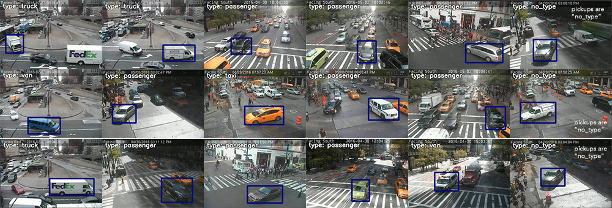

# shuffler

Toolbox for manipulating image annotations in computer vision.

- [Motivation](#motivation)
- [Functionality](#functionality)
- [Example use cases](#example-use-cases)
- [Installation](#installation)
- [Gentle introduction](#gentle-introduction)


## Motivation

Experts in computer vision train machine learning models to tackle practical problems, such as detecting vehicles in the autonomous car scenario or find faces in Facebook pictures. In order to train a model, researchers either use public datasets of annotated images or collect their own. In the process of fighting for better model performance, a researcher may want to change or filter image annotations, or to add another public dataset. Currently, each small group of researchers writes their own sripts to load, change, and save annotations. As the number of experiments grows, these custom scripts become more and more difficult to maintain. **Shuffler** eliminates the need for custom scripts by providing a multipurpose tool to import, modify, visualize, export, and evaluate annotations for common computer vision tasks.

## Functionality

Shuffler is a command line tool. It takes a dataset in one of the formats on inputs, performs a number of *operations*, and then records the output. Operations fall under these categories:

- [Import](https://github.com/kukuruza/shuffler/blob/master/doc/Subcommands.md#import) most common computer vision datasets. The list of supported datasets is growing.
- [Aggregate information](#info) about a dataset. Print basic statistics, plot histograms, and scatter plots.
- [GUI](https://github.com/kukuruza/shuffler/blob/master/doc/Subcommands.md#gui) lets a user to manually loop through a dataset, visualize, modify, and delete entries.
- [Filter](https://github.com/kukuruza/shuffler/blob/master/doc/Subcommands.md#filter) annotations, e.g. small objects, objects at image boundary, or objects without a color.
- [Modify](https://github.com/kukuruza/shuffler/blob/master/doc/Subcommands.md#modify) a dataset, e.g. increase bounding boxes by 20%, split a dataset into "train" and "test" subsets
- [Evaluate](https://github.com/kukuruza/shuffler/blob/master/doc/Subcommands.md#evaluate). Given ground truth and predictions, evaluate performance of object detection or semantic segmentation.
- Export. We provide a [PyTorch Dataset class](https://pytorch.org/tutorials/beginner/data_loading_tutorial.html#dataset-class) to directly load data from PyTorch. I plan to implement [Keras Dataset class](https://keras.io/utils/#sequence) and export to popular formats such as PASCAL.

The toolbox supports datasets consisting of 1) images and masks, 2) objects annotated with masks, polygons, and bounding boxes, and 3) matches between objects. It stores annotations as a SQL database of its custom format. This database can be viewed and edited manually with any SQL viewer.

Example:

```bash
./shuffler.py -o myPascal.db \
  importPascalVoc2012 ${VOC_DIR} --annotations \| filterObjectsSQL "SELECT objectid WHERE width < 20"
```

In this example, we import PASCAL VOC 2012 dataset from `${VOC_DIR}`, remove small objects, and save the annotations as an SQLite database `myPascal.db`. Later we may choose to export it back to the PASCAL format or to load data from `myPascal.db` to PyTorch directly. 


## Example use cases

#### Combine [KITTI](http://www.cvlibs.net/datasets/kitti), [BDD](https://bair.berkeley.edu/blog/2018/05/30/bdd), and [PASCAL VOC 2012](http://host.robots.ox.ac.uk/pascal/VOC) datasets into one ([link to code](#combine-datasets).)

A user works on object detection tasks for the autonomous car scenario, and would like to use as many annotated images as possible. In particular, they aim to combine certain classes from the datasets KITTI, BDD, and PASCAL VOC 2012. Then the combined dataset should be exported to a TF-friendly format.

#### Import annotations from [LabelMe](http://labelme.csail.mit.edu/Release3.0). Each image is labelled by multiple annotators ([link to code](#import-from-labelme))

A user has collected a dataset of images with objects. Images were handed out to annotators who use LabelMeAnootationTool. Each image was annotated with polygons by multiple annotators for the purposes of cross-validation. A user would like to to 1) import labels from all annotators, 2) merge polygons corresponding to the same object, 3) make black-gray-white image masks, where the gray area marks the inconsistency among annotators.

#### Train object detection with only big objects. Then evaluate properly.

We have a dataset with objects given as bounding boxes. We would like to remove objects on image boundary, expand bounding boxes by 10% for better training, remove objects of all types except "car", "bus", and "truck", and to remove objects smaller than 30 pixels wide. We would lile to use that subset for training.

In the previous use case we removed some objects for our object detection training task. Now we want to evaluate the trained model. We expect our model to detect only big objects, but we don't want to count it as a false positive if it detects a tiny object either.

#### Evaluate results of semantic segmentation

A neural network was trained to perform a semantic segmentation of images. We have a directory with ground truth masks and a directory with predicted masks. We would like to 1) evaluate the results, 2) write a video with images and their predicted segmentation masks side-by-side.

#### Write a dataset with image croppings of individual objects

We have images with objects. Images have masks with those objects. We would like to crop out objects with name "car" bigger than 32 pixels wide, stretch the crops to 64x64 pixels and write a new dataset of images (and the correspodning masks)


## Installation 

#### Using conda

Shuffler requires Python3. The installation instructions assume Conda package management system.

```bash
# If desired, add support for datasets stored as video (needs to go first).
conda install -y -c conda-forge ffmpeg=4.0

conda install -y imageio matplotlib lxml simplejson progressbar2 Pillow scipy
conda install -y opencv=3.4.2  # Require opencv3.

# If desired, add support for plotting commands
conda install -y pandas seaborn

# If desired, add support for unit tests
conda install -y nose scikit-image
```


## Instructions for the annotators

1. If you have experience using git from command line, clone this repository. Otherwise, find a tool to manage git repositories. For example, https://desktop.github.com. Using that tool, clone this repository.

2. Download Anaconda (or Miniconda) tool for managing Python packages. Pick the one with Python 3.5 or 3.6. Optionally create an conda environment. Install the following packages with Anaconda.

```
conda install -y imageio matplotlib lxml simplejson progressbar2 Pillow scipy
conda install -y opencv=3.4.2
```

3. Download the folder "annotating" from https://drive.google.com/open?id=1c6vLJbOG0cJSQBYM1A1lnqS3DMCUDcRA and unzip. Inside this folder, there are two zip archives: `test-full.zip` and `train-full.zip`. Unzip them. You should get this file structure:

```
annotating
|- test-full   (folder with images)
|- test-full.db
|- train-full  (folder with images)
|- train-full.db
```

4) Start an Anaconda terminal. In the terminal, cd to the directory “annotating”. In the commands below, replace `my_path_to_shuffler.py` with your actual path to file `shuffler.py` residing in the repo "shuffler". For example, on Mac it may be `/Users/evgeny/Downloads/shuffler/shuffler.py` and on Windows `C:\Users\evgeny\Downloads\shuffler-master\shuffler.py`. Run the following commands, and if any one of them fails contact Evgeny.

This command will print some information about usage:

```bash
python3 my_path_to_shuffler.py -h
```

This command will print some information about the database:

```bash
python3 my_path_to_shuffler.py --logging 10 -i train-full.db --rootdir . printInfo
```

This command should open a window with an image. You should see a window with images. You should be able to move forward and backwards between images using keys "-" and "=". To exit, press Esc.

```bash
python3 my_path_to_shuffler.py --logging 10 -i train-full.db --rootdir . examineImages
```

The command below should open a window with an image, and allow you to label individual cars with colors. The dictionary is below. For example, when you press a button "r", the car will be labelled as red. Navigation is the same as above.

- "r": "red"
- "g": "green"
- "b": "blue"
- "o": "orange"
- "y": "yellow"
- "k": "black"
- "w": "white"
- "a": "gray"
- Space key: color should not be assigned (no prominent color, color not seen well in the dusk, etc)
- Del key: delete the label

```bash
python3 my_path_to_shuffler.py --logging 10 -i train-full.db --rootdir . labelObjects --property color --key_dict "{'-': 'previous', '=': 'next', 27: 'exit', 127: 'delete_label', 'g': 'green', 'b': 'blue', 'o': 'orange', 'y': 'yellow', 'k': 'black', 'r': 'red', 'w': 'white', 'a': 'gray', ' ': 'no_color'}" --where_object "objectid NOT IN (SELECT objectid FROM properties WHERE key == 'color')"
```

The next command allows one to classify the car by type. Currently we use the following types. When in doubt, use "no\_type"

- "p": "passenger". Sedans, hatchbacks, sport cars, SUVs, etc. NOT pickups, NOT taxis.
- "t": "truck". Commercial trucks, UHauls, etc. NOT pickups.
- "v": "van". Commercial vans, normally with no windows.
- "t": "taxi". Any car labelled as taxi (can be yellow, green, black, etc.)
- "b": "bus". In-city or inter-city buses, school buses.
- Space key: Anything ambiguous, as well as motorbikes, bicycles, street-cleaning cars, construction cars that can not be called trucks, etc
- Del key: delete the label



```bash
python3 my_path_to_shuffler.py --logging 10 -i train-full.db --rootdir . labelObjects --property color --key_dict "{'-': 'previous', '=': 'next', 27: 'exit', 127: 'delete_label', 'p': 'passenger', 'b': 'bus', 'c': 'taxi', 't': 'truck', 'v': 'van', ' ': 'no_type'}" --where_object "objectid NOT IN (SELECT objectid FROM properties WHERE key == 'type')"
```


## Gentle introduction


### Chaining commands

Sub-commands can be chained via the special symbol "\|" (here, the backslash escapes the following vertical bar from a Unix shell.)

```bash
./shuffler.py --rootdir 'test' --in_db_file 'test/cars/micro1_v4.db' \
  addVideo --image_video_path 'test/moon/images.avi' --mask_video_path 'test/moon/masks.avi' \| \
  printInfo \| \
  moveMedia --image_path 'test/cars/images' --where_image 'imagefile LIKE "cars/images/%"' \| \
  dumpDb --tables 'images' 'objects'

./shuffler.py --rootdir 'test' --in_db_file 'test/cars/micro1_v4.db' \
  addDb --db_file 'test/cars/micro1_v4_singleim.db' \| \
  mergeObjectDuplicates \| \
  polygonsToMask --media='pictures' --mask_path 'cars/mask_polygons' --skip_empty_masks \| \
  dumpDb --tables images \| \
  examineImages --mask_alpha 0.5
```

## Code for the use cases

#### <a name="combine-datasets">Combine KITTI, BDD, and PASCAL VOC 2012 datasets into one</a>

```bash
KITTI=/path/to/directory/KITTI
VOC2012=/path/to/directory/VOC2012

./shuffler.py --rootdir ${KITTI} \
  -o '/tmp/kitti.db' \
  importKitti \
  --images_dir=${KITTI}/data_semantics/training/image_2  \
  --detection_dir=${KITTI}/data_object_image_2/training/label_2
```

#### <a name="import-from-labelme">Import from LabelMe, each image is labelled by multiple annotators.</a>

```bash
./shuffler.py --rootdir '.' -i 'test/labelme/init.db' \
  importLabelmeObjects --annotations_dir 'test/labelme/w55-e04-objects1' \
  --keep_original_object_name --polygon_name annotator1 \| \
  importLabelmeObjects --annotations_dir 'test/labelme/w55-e04-objects2' \
  --keep_original_object_name --polygon_name annotator2 \| \
  importLabelmeObjects --annotations_dir 'test/labelme/w55-e04-objects3' \
  --keep_original_object_name --polygon_name annotator3 \| \
  mergeObjectDuplicates \| \
  polygonsToMask --mask_pictures_dir 'test/labelme/mask_polygons' --skip_empty_masks \| \
  dumpDb --tables objects polygons \| \
  examineImages --mask_aside
```


## Examples of getting information about a dataset with standard SQLite.
```bash
# Print out names of objects and their count.
sqlite3 my_dataset.db "SELECT name, COUNT(1) FROM objects GROUP BY name"
```

## Testing code

Most of the backend and utilities are covered in unit tests. To run all tests, run:

```bash
cd test
python3 -m "nose"
```
