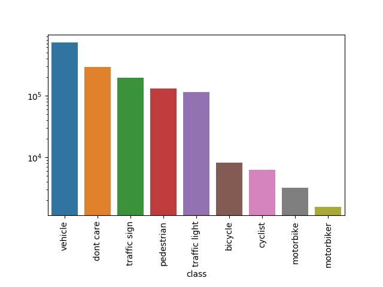
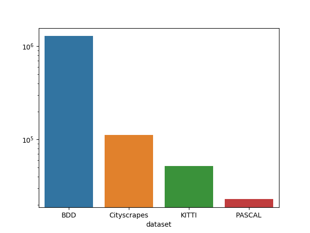
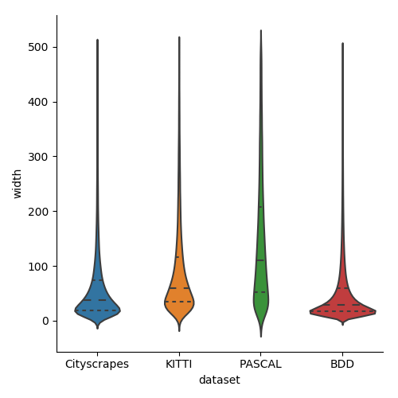

# Combining data from multiple datasets to train an object detector.

**(Tutorial level: advanced)**

In this tutorial, we are going to make a dataset for an autonomous driving startup from multiple publicly available datasets.
In particular, we will prepare data for training an object detector. The training data for such a task is a pool of pairs {image, bounding boxes}. Here, bounding boxes are essentially rectangles around each object of interest in the image.
The common classes of interest for self-driving are pedestrians, vehicles, bikes, traffic lights, traffic signs.

There exist several public datasets for the self-driving scenario. We will consider PASCAL VOC, KITTI, Cityscapes, and BDD. 
Each of them contains data in its own format. 
They contain annotated objects of various classes, plus some that we are not interested in, such as "bird" or "sky".
Moreover, some datasets have class "car", some -- "Car", and some distinguish vehicle subclasses.

Our goal is to combine all those objects, filter out unnecessary classes, and rename the classes so that we end up with the following categories:

- pedestrian
- vehicle (all types of cars)
- bicycle (without a rider)
- cyclist (bicycle plus a rider(s) on top)
- motorbike (without a rider)
- motobiker (motorbike plus a rider(s) on top)
- traffic light
- traffic sign
- dont care (ambigouos things that may confuse an algorithm)


### Install Shuffler.

Please follow [Installation Instructions](https://github.com/kukuruza/shuffler#installation).

Export the path to the Shuffler repo to an environmental variable `SHUFFLER_DIR`.

### Download datasets.

Download datasets from their official websites. Put them all into a new directory, and let the path of this directory be recorded in an environmental variable `DATASETS_DIR`.

- Download Cityscapes into `${DATASETS_DIR}/Cityscapes`.
- Download KITTI into `${DATASETS_DIR}/KITTI`.
- Download Pascal VOC 2012 into `${DATASETS_DIR}/Pascal`.
- Download BDD100 into `${DATASETS_DIR}/BDD`


### Import each dataset. 

The first step is to create a database for each of the datasets. More info at [Import Section](https://github.com/kukuruza/shuffler/blob/master/doc/Subcommands.md#import). The `rootdir` is set to the current directory by default, which means that image paths will be relative to the current directory. 

```bash
cd ${DATASETS_DIR}

${SHUFFLER_DIR}/shuffler.py -o 'kitti.db'  \
  importKitti \
  --images_dir=KITTI/data_object_image_2/training/image_2  \
  --detection_dir=KITTI/data_object_image_2/training/label_2

${SHUFFLER_DIR}/shuffler.py -o 'pascal.db' \
  importPascalVoc2012 --pascal_dir Pascal --segmentation_class

${SHUFFLER_DIR}/shuffler.py -o 'bdd100k_train.db' \
  importBdd \
  --images_dir BDD/bdd100k/images/100k/train \
  --detection_json BDD/bdd100k/labels/bdd100k_labels_images_train.json

${SHUFFLER_DIR}/shuffler.py -o 'cityscapes_trainval_gtfine.db' \
  importCityscapes \
  --cityscapes_dir Cityscapes \
  --split train val --type "gtFine" --mask_type labelIds
```


### Combine datasets.

The following command combines all four datasets into one, called `combined.db`. We assume that the environmental variables such as `CITYSCAPES_DIR` were defined in the previous step. Argument `db_rootdir` specifies the directory image paths are considered to be relative to.

```bash
${SHUFFLER_DIR}/shuffler.py -o combined.db \
  addDb --db_file kitti_detection.db \| \
  addDb --db_file pascal.db \| \
  addDb --db_file bdd100k_detection_train.db \| \
  addDb --db_file cityscrapes_trainval_gtfine.db
```

Some datasets contain masks, which we don't need. We can delete them using command-line tool sqlite3:

```bash
sqlite3 combined.db 'UPDATE images SET maskfile = null'
```

### Explore annotations

Let us look at the distribution of the classes in the database:

```bash
sqlite3 combined.db "SELECT name,COUNT(name) FROM objects GROUP BY name"
```

The output includes the following lines, among others:
```
...
motor|3002
motorbike|801
motorcycle|888
motorcyclegroup|9
...
```

Different datasets have different names for motorbikes. Let's see which datasets has which name:

```bash
sqlite3 combined.db '
    SELECT name, imagefile FROM objects WHERE name="motor" LIMIT 1;
    SELECT name, imagefile FROM objects WHERE name="motorbike" LIMIT 1;
    SELECT name, imagefile FROM objects WHERE name="motorcycle" LIMIT 1; 
    SELECT name, imagefile FROM objects WHERE name="motorcyclegroup" LIMIT 1; 
'
```

The command above outputs:

```
motor|BDD/bdd100k/images/100k/train/00225f53-67614580.jpg
motorbike|PASCAL/VOC2012/JPEGImages/2007_000364.jpg
motorcycle|Cityscapes/leftImg8bit/train/zurich/zurich_000069_000019_leftImg8bit.png
motorcyclegroup|Cityscapes/leftImg8bit/train/strasbourg/strasbourg_000000_029915_leftImg8bit.png
```

What does that `motorcyclegroup` mean? Cityscrapes docs tell us that this is a group of motorcycles where individual motocycles are not clearly seen. We can visually see it using Shuffler:

```bash
${SHUFFLER_DIR}/shuffler.py -i combined.db \
  examineObjects --where_object 'name="motorcyclegroup"' --shuffle
```


### Optinal step: classify "Misc" in KITTI

Another observation: classes for motorbike are in BDD, PASCAL, and Cityscapes, but not KITTI. What does KITTI not have a motorbike class? 

Let's first see all the classes of KITTI. Note the use of `LIKE "KITTI%"` in the command below. `LIKE` is the syntax for matching a pattern, `%` is a wildcard in SQL standing for any number of symbols, and `KITTI` is the name of my directory with KITTI dataset.

```bash
sqlite3 combined.db 'SELECT (name) FROM objects WHERE imagefile LIKE "KITTI%"'
sqlite3 combined.db 'SELECT name,COUNT(name) FROM objects WHERE imagefile LIKE "KITTI%" GROUP BY name'
```

Output:

```
Car|28742
Cyclist|1627
DontCare|11295
Misc|973
Pedestrian|4487
Person_sitting|222
Tram|511
Truck|1094
Van|2914
```

In the output, you will not find anything for motorbikes. The reason is that there are few of them in KITTI, and they are all put into "Misc" class. Just go through "Misc" to see it for yourself:

```bash
${SHUFFLER_DIR}/shuffler.py -i combined.db \
  examineObjects --where_object 'name="Misc" AND imagefile LIKE "KITTI%"' --shuffle
```

We can classify those motorcycles in Misc. There are 973 objects in Misc, it takes roughly 30 minutes to complete. We will label them as "motorbike" (press key "m"), "motorbiker" (press key "p"), and "Misc" (press the space key). Navigation is through keys "-"/"=". Press Esc to exit once at the last image.

```bash
# Label object by object using keyboard.
${SHUFFLER_DIR}/shuffler.py -i combined.db -o combined.db \
  labelObjects --property 'mylabel' \
    --key_dict '{"-": "previous", "=": "next", 27: "exit", " ": "Misc", "m": "motor", "p": "motorbiker"}' \
    --where_object 'name="Misc" AND imagefile LIKE "KITTI%"'
# Copy labels to object names.
${SHUFFLER_DIR}/shuffler.py -i combined.db -o combined.db \
  propertyToName --property "mylabel" --delete_property_after
```

If you look at the classes of KITTI again, you will see "motor" and "motorbiker" classes, and less objects in "Misc" class:

```
Car|28742
Cyclist|1627
DontCare|11295
Misc|791
Pedestrian|4487
Person_sitting|222
Tram|511
Truck|1094
Van|2914
motorbike|129
motorbiker|53
```


### Merge motor/motorbike/motorcycle with their riders

We face incompatible annotations. BDD and Cityscapes have classes "bike"/"bicycle" and class "rider" that refers to a person on top of the bike or a motorcycle. KITTI has the type "cyclist" where bike and its rider is merged into a single class.

We will merge bike riders with their bikes in order to match KITTI format. That is, we will merge objects of class "bicycle"/"bike" and of class "rider" when they intersect in the image. The merged object will have the type "cyclist". 

Similarly, objects "motocycle"/"motor"/"motorbike" are merged with "rider" to make objects "motorbiker".

```bash
${SHUFFLER_DIR}/shuffler.py -i combined.db -o combined.db \
  mergeIntersectingObjects --IoU_threshold 0.01 --target_name 'cyclist' \
    --where_object1 'name == "rider"' --where_object2 'name IN ("bicycle", "bike")' \| \
  mergeIntersectingObjects --IoU_threshold 0.01 --target_name 'motorbiker' \
    --where_object1 'name == "rider"' --where_object2 'name IN ("motorbike", "motocycle", "motor")'
```

It is time examine the results:

```bash
${SHUFFLER_DIR}/shuffler.py -i combined.db \
  examineObjects --where_object 'name="cyclist"' --shuffle
${SHUFFLER_DIR}/shuffler.py -i combined.db \
  examineObjects --where_object 'name="motorbiker"' --shuffle
```

Note that there are still non-merged bicycles and motorbikes, that are parked in the street.


### Bring all to common names.

All different types of cars and names for them are merged into one single category "vehicle". The same apllies to (motor)bikes. "Dont care" class combines things that are either specific to a dataset (i.e. "ego vehicle") or may confuse a detection algorithm.

```bash
sqlite3 combined.db '
  UPDATE objects SET name="vehicle" WHERE name IN ("car", "bus", "trailer", "truck", "train", "caravan", "Truck", "Car", "Tram", "Van");
  UPDATE objects SET name="pedestrian" WHERE name IN ("person", "Pedestrian", "Person_sitting");
  UPDATE objects SET name="dont care" WHERE name IN ("DontCare", "Misc", "ridergroup", "truckgroup", "bicyclegroup", "persongroup", "ego vehicle", "out of roi", "rectification border");
  UPDATE objects SET name="cyclist" WHERE name IN ("cyclist", "Cyclist");
  UPDATE objects SET name="motorbike" WHERE name IN ("motor", "motorbike", "motorcycle");
  UPDATE objects SET name="bicycle" WHERE name IN ("bicycle", "bike");
'
```

### Remove unused names.

We have to do this via Shuffler, not in `sqlite3` tool, because deleting an object also requires deleting its properties and polygons. Shuffler takes care of that.

```bash
${SHUFFLER_DIR}/shuffler.py -i combined.db -o combined.db \
  filterObjectsByName --good_names "vehicle" "pedestrian" "motorbiker" "motorbike" "cyclist" "bicycle" "traffic sign" "traffic light" "dont care"
```

Let's see how many objects are in each class:

```bash
sqlite3 combined.db "SELECT name,COUNT(name) FROM objects GROUP BY name"
```

```
bicycle|8351
cyclist|6227
dont care|27369
motorbike|3281
motorbiker|1592
pedestrian|134872
traffic light|198015
traffic sign|264662
vehicle|825371
```


### Clean some bad objects.

First, there are some objects with height=0 or width=0. Get rid of them:

```bash
${SHUFFLER_DIR}/shuffler.py -i combined.db -o combined.db \
  filterObjectsSQL 'SELECT objectid FROM objects WHERE width == 0 OR height == 0'
```

The dataset has objects that are so far away and small that it's not even clear why they are labelled like that. In any case, most detection algorithms do not work well with tiny objects. Let us convert them into "dont care" class. We can't just throw them out, because a neural network should not think they are the background.

```bash
sqlite3 combined.db 'UPDATE objects SET name="dont care" WHERE width < 10 AND height < 10'
```

BDD gets messy sometimes. For example, some of further "vehicle" objects are just barely visible behind ocluding objects. Traffic signs stand for both regulatory and informational signs (such as street names.) Just take a look at some of the vehicles in BDD:

```bash
${SHUFFLER_DIR}/shuffler.py -i combined.db \
  examineObjects --where_object 'name="vehicle" AND imagefile LIKE "%BDD%"' --shuffle
```

We will convert into "dont care" any BDD objects smaller than 25x25, and all traffic signs. Ideally we'd like to keep regulatory ones and discard informational ones, but these two types are not labelled in any way and there are too many of them to classify them manually (please do it if you have resources.) Alas.


```bash
sqlite3 combined.db '
  UPDATE objects SET name="dont care WHERE "
      imagefile LIKE "%BDD%" AND 
      ((width < 20 AND height < 20) OR (name="traffic sign"));
  SELECT name,COUNT(name) FROM objects GROUP BY name;
  '
```

The last SELECT yielded the folllowing output. Notice how the number of "dont care" class went up from 27K to 290K.

```
bicycle|8265
cyclist|6216
dont care|290676
motorbike|3202
motorbiker|1564
pedestrian|129528
traffic light|114583
traffic sign|196256
vehicle|719450
```


### Clean up

Let's get rid of the empty PASCAL images, that don't have the road anyway:

```bash
${SHUFFLER_DIR}/shuffler.py -i combined.db \
  filterEmptyImages --where_image 'imagefile LIKE "PASCAL%"'
```

Finally, we can optimize the performance and size of the database by cleaning up after deleting so many objects.

```bash
sqlite3 combined.db "VACUUM;"
```

### Inspect

Now is the time for looking at the result and seeing for ourselves what a fancy dataset we have just created.

There are 92K images and 1.5M objects in this new dataset. How did I get these numbers? Run the following command.

```bash
sqlite3 combined.db "SELECT COUNT(1) FROM images; SELECT COUNT(1) FROM objects;"
```

Let's go through images with a visually see the result:

```bash
${SHUFFLER_DIR}/shuffler.py -i combined.db \
  examineImages --with_objects --shuffle
```

Now we generate three plots: a histogram of objects by type, distribution of sizes of objects, the distribution of classes by dataset, and finally, the histogram of object width by dataset. The last two command have the expression `substr(imagefile,0,instr(imagefile, '/'))`. This is a SQLite syntax taking a substring of `imagefile` -- from its beginning up to the first `/` character.

```bash
${SHUFFLER_DIR}/shuffler.py -i combined.db \
  plotHistogram  --categorical --xlabel "class" --ylog --rotate_xlabels 90 \
    --sql "SELECT name FROM objects" \
    --out_path objects_by_class.eps \
  \| \
  plotHistogram  --categorical --xlabel "dataset" --ylog \
    --sql "SELECT substr(imagefile,0,instr(imagefile, '/')) FROM objects" \
    --out_path objects_by_dataset.eps \
  \| \
  sql "DELETE FROM objects WHERE width >= 500"  \
  \| \
  plotViolin --xlabel "dataset" --ylabel "width" \
    --sql "SELECT substr(imagefile,0,instr(imagefile, '/')), width FROM objects" \
    --out_path objects_by_width.eps
```






## Export to COCO

Are you sure you want to export 92K images? An alternative is use a generator that is specially written for this project. The following command creates the COCO structure with the subset "combined", copies images there, and writes annotations.

```bash
${SHUFFLER_DIR}/shuffler.py -i combined.db \
  exportCoco --coco_dir COCO --subset combined --copy_images
```


## Aftermath

In this tutorial, we imported data from BDD, KITTI, Cityscapes, and Pascal into the Shuffler format, and combined the datasets into a single one. We renamed some objects to account for inconsistencies among classes. We merged motorbikes/bycicles with their riders into a single object. Finally, we filtered tiny objects, and some of the objects in BDD.

Along the way, we were printing out statistics about data, and also visually looked at annotated images and objects. In the end, we made some plots that sum up information about the dataset.


## Pitfalls

- Shuffler takes an input argument -- `rootdir`. It signifies the what is the directory that the imagepaths are relative to. In this tutorial we avoidded it altogether by running all the commands from the directory that had our datasets.
