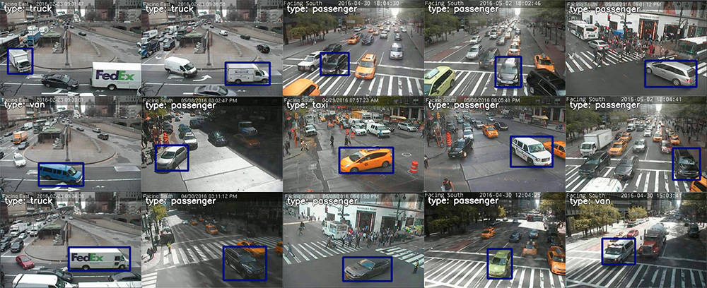
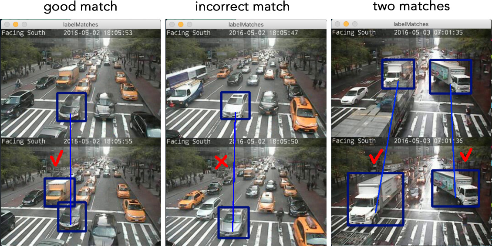

## Labelling the color and type of some cars in a dataset, and matching cars across frames.

**(Tutorial level: medium)**


### Install Shuffler.

Please follow [Installation Instructions](https://github.com/kukuruza/shuffler#installation).

Export the path to the Shuffler repo to an environmental variable `SHUFFLER_DIR`.


### Download the dataset.

Download the folder "annotating" from https://drive.google.com/open?id=1c6vLJbOG0cJSQBYM1A1lnqS3DMCUDcRA and unzip. Inside this folder, there are two zip archives: `test-full.zip` and `train-full.zip`. Unzip them. You should get this file structure:

```
annotating
|- test-full   (folder with images)
|- test-full.db
|- train-full  (folder with images)
|- train-full.db
```


### Test the installation.

Start an Anaconda terminal. In the terminal, cd to the directory “annotating”. In the commands below, replace `my_path_to_shuffler.py` with your actual path to file `shuffler.py` residing in the repo "shuffler". For example, on Mac it may be `/Users/evgeny/Downloads/shuffler/shuffler.py` and on Windows `C:\Users\evgeny\Downloads\shuffler-master\shuffler.py`. Run the following commands, and if any one of them fails contact Evgeny.

This command will print some information about usage:

```bash
${SHUFFLER_DIR}/shuffler.py -h
```

This command will print some information about the database:

```bash
${SHUFFLER_DIR}/shuffler.py --logging 10 -i train-full.db --rootdir . printInfo
```

This command should open a window with an image. You should see a window with images. You should be able to move forward and backwards between images using keys "-" and "=". To exit, press Esc.

```bash
${SHUFFLER_DIR}/shuffler.py --logging 10 -i train-full.db --rootdir . examineImages
```

### Labelling color

The command below should open a window with an image, and allow you to label individual cars with colors. The dictionary is below. For example, when you press a button "r", the car will be labelled as red. Navigation is the same as above.

- "r": "red"
- "g": "green"
- "b": "blue"
- "o": "orange"
- "y": "yellow"
- "k": "black"
- "w": "white"
- "a": "gray"
- Space key: color should not be assigned (no prominent color, color not seen well in the dusk, etc)
- Del key: delete the label

```bash
${SHUFFLER_DIR}/shuffler.py --logging 10 -i train-full.db --rootdir . labelObjects --property color --key_dict "{'-': 'previous', '=': 'next', 27: 'exit', 127: 'delete_label', 'g': 'green', 'b': 'blue', 'o': 'orange', 'y': 'yellow', 'k': 'black', 'r': 'red', 'w': 'white', 'a': 'gray', ' ': 'no_color'}" --where_object "objectid NOT IN (SELECT objectid FROM properties WHERE key == 'color')"
```

### Labelling car type

The next command allows one to classify the car by type. Currently we use the following types. When in doubt, use "no\_type"

- "p": "passenger". Sedans, hatchbacks, sport cars, SUVs, etc. *NOT* taxis.
- "t": "truck". Commercial trucks, UHauls, pickups, etc.
- "v": "van". Commercial vans, normally with no windows.
- "c": "taxi". Any car labelled as taxi (can be yellow, green, black, etc.)
- "b": "bus". In-city or inter-city buses, school buses.
- Space key: Anything ambiguous, as well as motorbikes, bicycles, street-cleaning cars, construction cars that can not be called trucks, etc.
- Del key: delete the label

```bash
${SHUFFLER_DIR}/shuffler.py --logging 10 -i train-full.db --rootdir . labelObjects --property color --key_dict "{'-': 'previous', '=': 'next', 27: 'exit', 127: 'delete_label', 'p': 'passenger', 'b': 'bus', 'c': 'taxi', 't': 'truck', 'v': 'van', ' ': 'no_type'}" --where_object "objectid NOT IN (SELECT objectid FROM properties WHERE key == 'type')"
```




### Labelling matches

The next command allows one to label matching cars.
At the start you should see a window with two images one under another.

- Press and hold the mouse at a box in the TOP image, and release at a box in the BOTTOM image. That will add a match between that pair of objects. If one of the two boxes were already matched to a different object, a new match will not be added.
- Click on a box in the TOP image and then press "Del" key to remove a match if the top box was incorrectly matched.
- Press "-" / "=" takes you accordingly to the previous and the next image pair.
- Press "Esc" to save changes and exit.

```bash
${SHUFFLER_DIR}/shuffler.py --logging 10 -i train-full.db --rootdir . labelMatches --where_images "imagefile NOT IN (SELECT imagefile FROM objects INNER JOIN matches ON objects.objectid == matches.objectid)"
```




